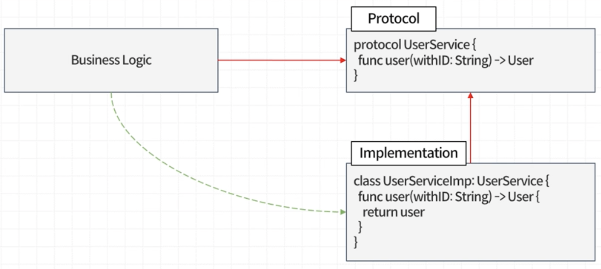

# ExtensibleAppArchitecture

📱 패스트캠퍼스, The RED : 슈퍼앱 운영을 위한 확장성 높은 앱 아키텍처 구축 공부내역 정리 : [🔗 FastCampus 강좌링크](https://fastcampus.co.kr/courses/206295/clips/)

패스트캠퍼스 강의코드에 Xcodegen을 적용. 

* [📁 Xcodegen](https://github.com/yonaskolb/XcodeGen)

*  [📑 Xcodegen project.yml 구조](https://github.com/MOON-HJ/ExtensibleAppArchitecture/blob/main/project.yml) 

------

### Scale과 연관된 다양한 문제

| **개발자가 겪는 문제**                                       | 사용자가 겪는 문제                                           |
| ------------------------------------------------------------ | ------------------------------------------------------------ |
| - 빌드시간 증가 - 코드 충돌 증가 - QA, 디버깅 시간 증가 - 끊이지 않는 회귀 버그 - 개발 소요 시간 증가 - ... | - 엡 Startup 시간증가 - 과도한 리소스 사용 - 앱 용량 증가 - 버그 증가 - 앱 안정성 하락 - ... |

### 확장 가능한 앱 아키텍처의 특징

- **명확한 역할 구분** : 객체/모듈은 하나의 역할만 수행, 데이터의 흐름을 쉽게 따라갈 수 있음
- **변화에 유연** : 의존성은 decoupling 되어있고, 구조가 단순하기 때문에 유연
- **테스트가 용이** : 유닛 테스트가 어렵다면 구조 개선이 필요하다는 신호, 테스트는 품질 관리에 유용

------

## 아키텍쳐와 Composition

**Favor Object Composition Over Class Inheritance** - Gang of Four, Design Patterns(1994)

객체합성을 활용, 상속은 유연하지 못함 - 코드강한 결합의 형태임

하나의 객체가 너무 많은것을 알고 있는 경우가 좋을때는 많이 없음
더 작고 더 적은 정보를 가진 객체를 만드는게 유지보수 측면에서 좋음

### **앱** **로직의** 분류

| 외부 디펜던시                                                | 비즈니스 로직                                                | UI                                                           |
| ------------------------------------------------------------ | ------------------------------------------------------------ | ------------------------------------------------------------ |
| **데이터 저장** : 메모리 캐시 바이너리, 데이터베이스, 파일 등 **서비스** : 네트워크, 블루투스, 위치 서비스 | **내비게이션** : 화면의 이동 ( present, dismiss, push, pop)  **코디네이션** : 각종 레이어를 조합해 앱이 사용자를 위해 하는 일 | **뷰** : UIView, UIViewController **프레젠테이션** : 이미지 색상 폰트 등 UI모델 변환 |

------

## RIBs Pattern

 하나의 로직의 단위에는 Router, Interactor, Builder, View → 하나의 단위는 리블렛이라 부름

- Builder : 리블렛의 객체들을 생성 라우터를 리턴하는 역할
- Interactor : 로직이 들어가는 부분, 두뇌역할
- Router : 리블렛 테일을 만들고 뷰나 뷰컨트롤러 간의 라우팅 역할을 수행.

------

## 모듈 레벨 아키텍쳐

### 모노리틱 앱 구조

- 단일 타겟 ( 모듈)
- 객체 간 무분별한 참조
- 코드 변경의 영향 범위 파악이 힘듦
- 빌드 시간 증가에 따른 생산성 저하

#### 모듈화 구조

→ 잘 나눠진 모듈은 계층화 할 수 있음, 상위에 있는 모듈은 하위에 있는 모듈에 접근할 수 있지만, 반대의 경우는 접근할 수 없음
체계적인 설계를 통해 로직이 단방향으로 흐르게 만드는 것이 중요

**모듈화 구조의 장점**

- 관심사가 분리된다.
- 코드파악이 빠르다

모듈화란 모듈을 만드는 행위가 중요한 것이 아니라 객체나 로직들의 참조관계를 정리하는것이 핵심

------

## 느슨한 결합

의존성 

- 코드의 호출(런타임 의존성)
- 소스코드 의존성(컴파일타임 의존성)

Xcode는 병렬로 빌드를 하기 때문에 앱의 빌드시간을 줄이기 위해서는 병목모듈을 찾아서 그 모듈의 빌드시간을 줄여야함

**The power of OO comes from safe, convenient polymorphism with OO you have absolute control over the every single source code dependency in your system** - Robert C. Martin, The Future Of Programming Languages

다형성을 이용한 의존성 역전

공통기능 모듈이나 빌드시간이 오래 걸리는 모듈을 소스코드 의존성을 끊어버림으로서 내 모듈의 빌드시간에 영향받지 않게 만들 수 있음

### 느슨하게 결합된 모듈 구조의 장점

**확장과 재사용**

- 새 기능 개발, 기존 기능 수정 수월
- 모듈별로 독립적인 재사용가능

**병렬개발**

- 규모가 큰 팀에게 필수
- 고립된 개발환경
- 미완성 모듈에도 의존할 수 있음

**유지보수**

- 모듈의 경계가 명확
- 수정, 영향범위 파악이 쉬움
- 개발 생산성 향상
- 빌드시간 단축

**테스트 용이성**

- 테스트 대역으로 치환
- 빠른 자동화 테스트

### 의존성 역전의 한계/단점

- 코드를 이해하기 어려워짐 (코드 호출의 흐름을 따라가기 어려움)

------

## 의존성 주입

### 의존성 주입 패턴

- 생성자 주입
- 메소드 주입
- 프로퍼티 주입

화면 흐름에 따라 상위화면은 자신에게 필요없는 불필요한 의존성을 들고 있어야함, 이를 해결하기 위해  Composition Root를 통해 화면에 필요한 의존성들을  Composition Root가 들고 있게 하고 각 화면을 생성하는 역할을 담당하게 하면 다음화면의 의존성을 이전화면이 들고 있지 않게 할 수 있음

Composition Root, ( Flow Controller / Coordinator )

### 의존성을 주입할 것인가 말것인가

|      | **Volatile Dependency**                                      | **Stable Dependency**                                        |
| ---- | ------------------------------------------------------------ | ------------------------------------------------------------ |
|      | 주입해야하는 의존성                                          | 주입할 필요없는 의존성                                       |
|      | - 사용하기전 Runtime에 초기화가 필요한것 - 아직 존재하지 않거나 개발중인 것 - 비결정론적 동작/알고리즘 | - 결정론적 동작/알고리즘 - 신뢰할만한 하위호환성 - Volatile 의존성을 제외한 모든 것 |
| 예   | 데이터베이스, 옆팀이 개발하고 있는 결제 모듈, 랜덤함수, Date() 등등.. | Foundation, 유틸성 코드, Formmater                           |

